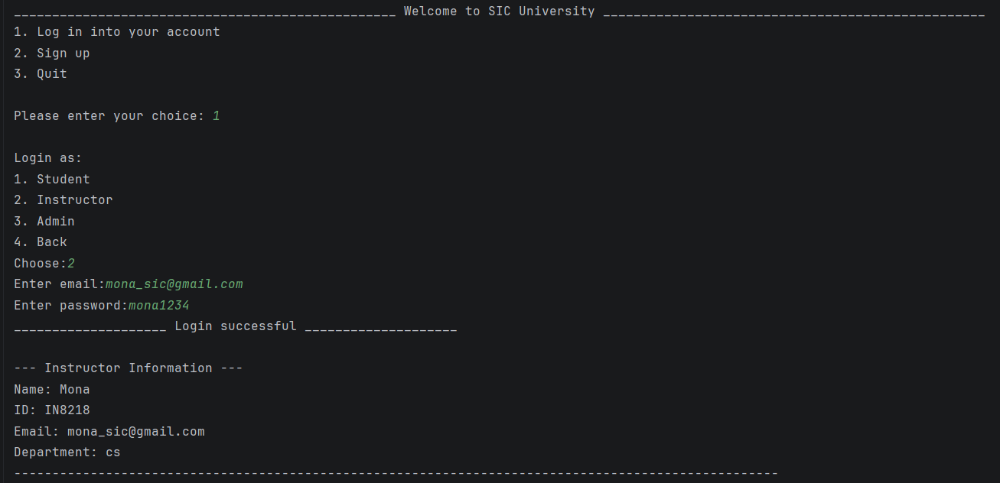
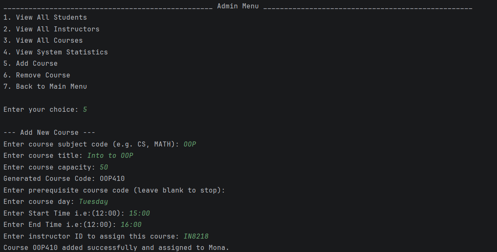
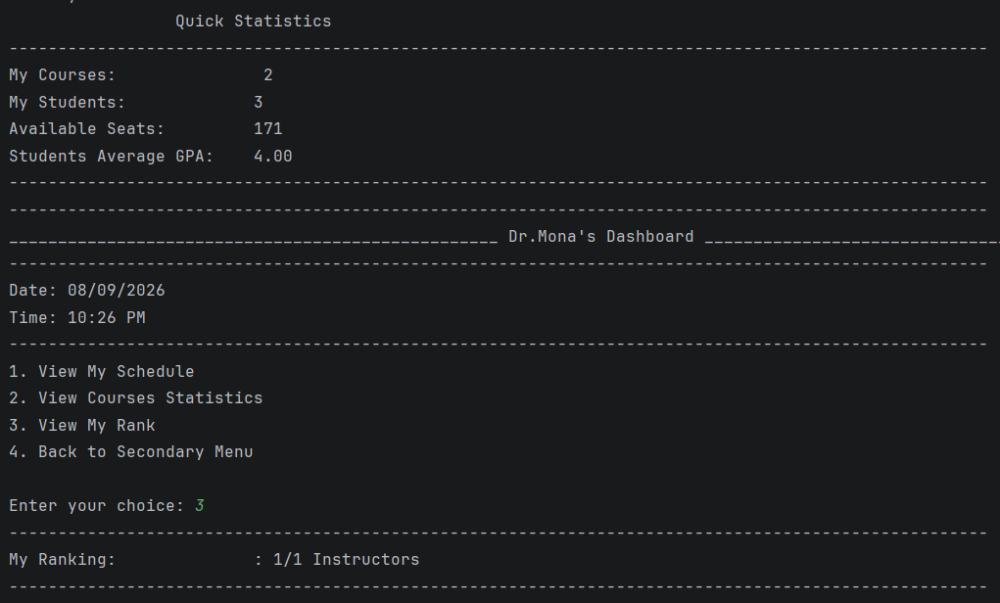
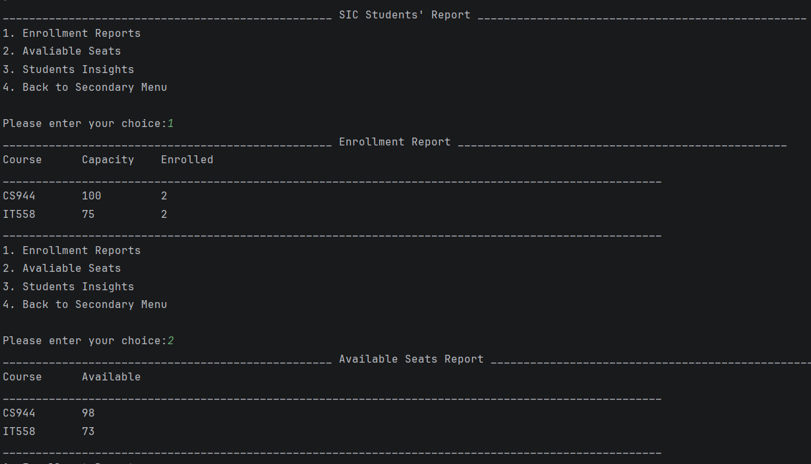
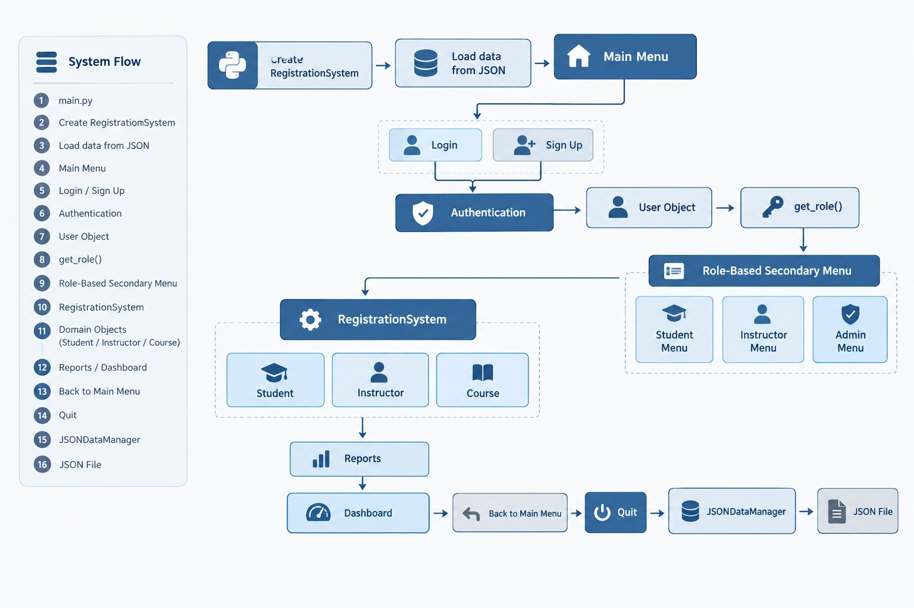

# 🎓 SIC University System

A role-based, console-based **university course registration and management system** built in Python.
Final project for the **Samsung Innovation Campus – SIC 801 CP Course (Team 9)**, in partnership with Life Makers Foundation Egypt.

  

🎥 **Demo video:** [DEMO_VIDEO_LINK](https://youtu.be/t5DAP59zK60) &nbsp;|&nbsp; 📊 **Presentation:** [SLIDES_LINK](https://drive.google.com/file/d/1gCizN8IL-INh_Dd0Fx-xNPZul9BGomTt/view?usp=drive_link)

---

## Overview

Students, instructors, and admins each get their own menu and permissions inside one shared console application.
The system validates real-world rules (seat limits, prerequisites, schedule conflicts, duplicate enrollment) and saves everything to a JSON file, so nothing is lost between sessions.



## Features

### Authentication
- Login and sign-up flows for students and instructors
- Accounts checked against stored email/password records
- Input rules: valid name, valid email format, password of 8+ characters

### Course Management
- Admins and instructors can add or remove courses
- Auto-generated unique course codes (e.g. `CS944`)
- Configurable prerequisites and seat capacity
- Day/time scheduling with automatic conflict detection for instructors



### Enrollment
- Students can browse available courses and enroll or drop
- Instructors can enroll or drop students in their own courses
- Prerequisite chains are validated recursively before enrollment
- Duplicate enrollment and full-course conditions are blocked

### Grades & GPA
- Instructors record letter grades per course
- GPA is calculated automatically on a standard 4.0-point scale
- Students can view a full grade report with their live GPA

### Reports & Dashboard
- Instructor dashboard: personal schedule, course statistics, and ranking against other instructors by average student GPA
- Admin view: system-wide statistics, enrollment reports, and available-seats reports




### Role-Based Access
- Students, instructors, and admins each see a distinct menu
- Instructors are scoped to their own courses and roster
- Admins have full system oversight (accounts, courses, statistics)

### Persistence
- All data (students, instructors, admins, courses, enrollments, grades) is saved to and loaded from `university_data.json`

## Project Structure

```
├── main.py                        # Entry point
├── person.py                      # Base Person class (shared identity/validation logic)
├── student.py                     # Student class + registration helpers
├── instructor.py                  # Instructor class
├── admin.py                       # Admin class
├── Authentication.py              # Login and sign-up
├── course.py                      # Course class, custom exceptions, course helpers
├── registration_system.py         # Core RegistrationSystem: business logic and rules
├── JSONDataManager.py             # Save/load system state to/from JSON
├── Uni_Main_Menu.py               # Top-level login/signup menu
├── Uni_Secondary_Menu.py          # Base class for role-specific menus
├── Student_Secondary_Menu.py      # Student menu
├── Instructor_Secondary_Menu.py   # Instructor menu
├── Admin_Secondry_Menu.py         # Admin menu
├── Instructor_Dashboard.py        # Instructor dashboard (schedule, stats, ranking)
├── Instructor_Report.py           # Enrollment / seats / student insight reports
├── university_data.json           # Demo data (sample accounts, courses, enrollments)
└── docs/                          # Class diagrams and screenshots
```

## Getting Started

### Requirements
- Python 3.8+
- No external dependencies (standard library only)

### Run

```bash
git clone https://github.com/YOUR_USERNAME/SIC-University-System.git
cd SIC-University-System
python main.py
```

On startup the system loads `university_data.json`. On exit it saves the current state back to that file.

### Usage

1. From the **Main Menu**, choose **Log in** or **Sign up**.
2. Sign-up lets you register as a Student or Instructor (a default admin exists out of the box).
3. After logging in you get a menu for your role:
   - **Student**: view schedule, browse/enroll/drop courses, view grade report
   - **Instructor**: manage courses, roster, enrollment, grades, reports, dashboard
   - **Admin**: view all students/instructors/courses, system statistics, add/remove courses

### Demo Accounts

The included `university_data.json` contains sample data only. Use these to try each role:

| Role       | Email                 | Password    |
|------------|-----------------------|-------------|
| Student    | `ahmed2@example.com`  | `Demo@1234` |
| Instructor | `mona@example.com`    | `Demo@1234` |
| Admin      | `sic_admin@gmail.com` | `admin213`  |

> These are demo credentials for testing only. Do not reuse them anywhere real.

## Core Design Concepts

- **Inheritance**: `Person` is the shared base class for `Student`, `Instructor`, and `Admin`
- **Custom exceptions**: domain-specific errors (`InvalidCourseCodeError`, `StudentNotFoundError`, `DuplicateEnrollmentError`, `CourseFullError`, `MissingPrerequisiteError`, and more)
- **Recursion**: prerequisite chains are validated recursively (`check_prerequisite_chain`)
- **Closures**: seat availability via `create_seat_checker`, GPA calculation via `create_gpa_calculator`
- **Iterators**: `StudentCourseIterator` implements `__iter__`/`__next__` to walk a student's enrolled courses
- **Functional filtering**: `get_available_courses` uses `filter()` to find open courses

## Documentation

Class diagrams and the program flow are in [`docs/class-diagrams`](docs/class-diagrams):



More screenshots of every role's menus are in [`docs/screenshots`](docs/screenshots).

## Possible Improvements

- Hash passwords instead of storing them in plain text
- Add automated unit tests
- Move from a console app to a web app backed by a database

## Team

**SIC 801 – CP Course – Team 9**

| Member | Part | LinkedIn |
|--------|------|----------|
| Mennatallah Ahmed Abdel Salam | Course part | [Profile](MENNA_LINKEDIN_URL) |
| Sama Magdy Elalamy | Report part | [Profile](SAMA_LINKEDIN_URL) |
| Beshoy Emeil Boshra | Instructor part | [Profile](BISHOY_LINKEDIN_URL) |
| Adham Kamal Soliman | Student part | [Profile](ADHAM_LINKEDIN_URL) |

Thank you to our mentors **Eng. Ahmed Medhat** and **Eng. Dina Nabil**, and to Samsung Innovation Campus and Life Makers Foundation Egypt.

## License

Released under the [MIT License](LICENSE).
